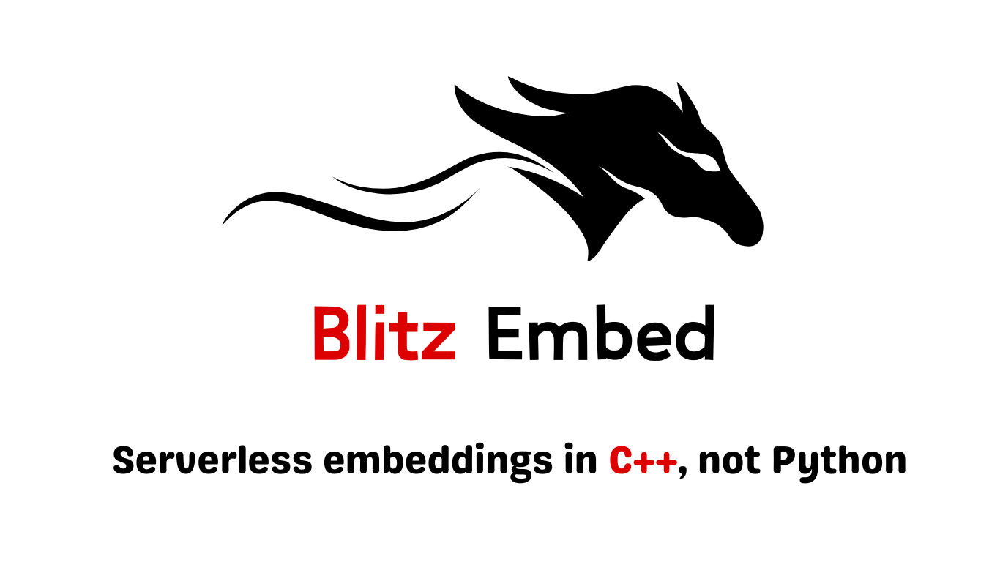
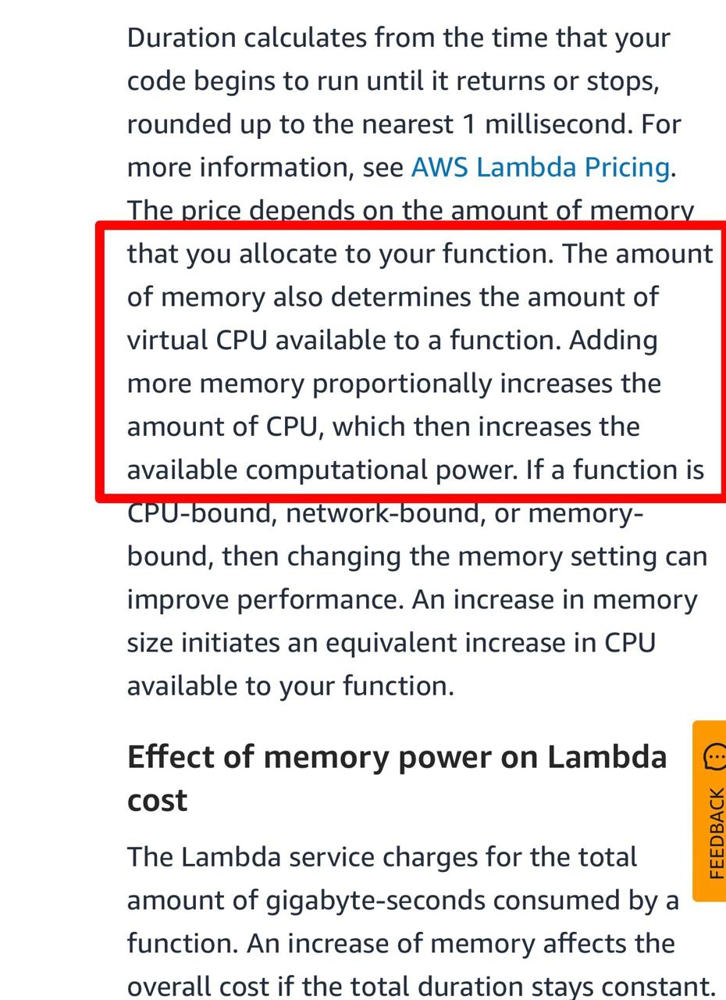

<p align="center">
  
</p>

**<font color="red">\[IMPORTANT UPDATE FOR AWS LAMBDA USERS\]:</font>** C++ Inference runs are CPU bound but needs very low working memory. **AWS lambda charges you based on the runtime x memory allocated. (unlike Azure functions or Google cloud run not consumed memory or observed memory)**. That is totally against the philosophy of "pay-per-use". So with AWS only way to get best runtime performance with AWS is to increase the memory to max which will blow up the cost. Thanks to a user pointing this out while testing in low memory settings. AWS is also open about it. See image below. 

**<font color="red">\[DO NOT WITH AWS LAMBDA\]:</font>** Until,

- Option 1: Either AWS allows us to increase vCPUs without having to increase memory.
- Option 2: Or Charged us for run time x used memory (and not allocated memory).
- (I will update this notice if either happens.)

**\[ALTERNATE\]:**

As previously commited in the roadmap (below), Working to extend this to run with Azure functions (as they surely charge for memory used / observed and not allocated. AFAIK same is the case for google cloud run.)


- [AWS lambda pricing](https://lnkd.in/eu6k4e-3)
- [Azure functions pricing](https://azure.microsoft.com/en-us/pricing/details/functions/)

<p align="center">
  
</p>


## What is it ?
C++ inference wrappers for running blazing fast embedding services on your favourite serverless.

- Leverages`GGML BERT` implementations.
- Bare-metal performance with e2e C++, No Python bindings.
- Speed without compromise of quality.(See benchmarks)
- Scale (`DIY Socket servers`, `vanilla HTTP` or `gRPC` deployments are no match to the scale or $ of Serverless like AWS lambda. ).
- Quantisation options - `q8_0`, `q5_0`, `q5_1`, `q4_0`, and `q4_1`.
- Super Economical as you pay / invocations that are tiny + quicker runtimes.
- Supports `BERT based embedders`. (Any lang)
- Smart folks have tested on: `BAAI/bge* models like bge-base-en-v1.5 and Sentence Transformers/all-MiniLM* models like all-MiniLM-L6-v2`.
- [Pre-quantised models to get started](https://huggingface.co/collections/prithivida/gguf-models-65e12c930890daf03e7e42ea).
- Optionally deploy on CUDA infra for GPU support.
- Forked with thanks from [bert GGML + python bindings](https://github.com/iamlemec/bert.cpp), [bert.cpp](https://github.com/skeskinen/bert.cpp), [embeddings.cpp](https://github.com/xyzhang626/embeddings.cpp)

## Who is it for ?
- Any one who wants to run a perfomant / cost efficent embedding service on SoTA embedders.
- Fair warning: Learning curve can be a little steep for absolute beginners.
 

### Contributions:
- C++ AWS Lambda handler for GGML bert. [[Jump to "Get started"]]()
- Prepackaged Dockerfiles for AWS Lambda.
- GGUF files in `HuggingFace`.

### Roadmap
<details>
<summary>Features</summary>

- C++ GCP functions handler + Docker file.
- C++ Azure functions handler + Docker file.
- Add support for embeddders like BGE-M3, allmpnet, SPLADE models.
- Add support for Matryoshka embeddings.
- Extend GPU support for standalone deployments.
- Bring in developments embedding related from llama.cpp.
</details>

### Why 4-bit quantisation is recommended ?
`Quantisation Jesus Tim Dettmers` has argued in the [15th min of this video](https://www.youtube.com/watch?v=y9PHWGOa8HA) and in this [paper](https://arxiv.org/pdf/2212.09720.pdf)
that 4-bit quantisation yields "best bit by bit performance" for a model.


### Install & launch a embedding service in AWS Lambda
<details open>
<summary>Steps Involved</summary>

```sh

# 1.Clone repo

git clone https://github.com/PrithivirajDamodaran/blitz-embed.git
cd blitz-embed

# 2. Setup Serverless for AWS if you haven't
```

    Goto AWS IAM user Dashboard
    Create or reuse a user.
    Add AdministratorAccess permissions tab
    Get your_key and your_secret from Security Credentials tab


```sh
export AWS_ACCESS_KEY_ID=your_key
export AWS_SECRET_ACCESS_KEY=your_secret

Use npm install -g serverless 


# 3. Run
# ensure docker daemon is running
serverless deploy
```
</details>

### Calling embedding service in your app
<details open>
<summary>Python snippet</summary>

```python
import requests
import json
import time
import numpy as np

url = 'https://your-service-url.amazonaws.com/encode'
payload = {
    "sent": [
        "It's OK to be wrong. Just don't be confident and wrong.",
        "Never ask your troops to do something you're not willing to do.",
        "The only rules are the ones dictated by the laws of physics. Everything else is a recommendation.",
        "When hiring, look for people with the right attitude. Skills can be taught. Attitude requires a brain transplant.",
    ],
    "model": "/opt/bge-base-en-v1.5-q4_0.gguf",
    "batch_size": 4,
    "max_len": 256,
    "normalise": True,
}

resp = requests.post(url=url, json=payload)
resp_obj = resp.json()
embeds = json.loads(resp_obj["embedding"])
emb = np.array(embeds, dtype="float32")
print("Tokenisation and Inference time", round(resp_obj["itime"], 1) * 0.001, " ms") # / 1000 as this time comes in microseconds
```
</details>

### Exporting and Quantising Huggingface models

#### Install 
```python
git clone https://github.com/PrithivirajDamodaran/blitz-embed.git
cd blitz-embed
git submodule update --init --recursive
pip install -r requirements.txt
cmake -B build . && make -C build -j
```
#### Convert

default is f32, for f16 you need to as pass param as below

```python
mkdir models
python blitz-embed/convert.py BAAI/bge-base-en-v1.5 models/bge-base-en-v1.5-f16.gguf f16
```

#### Quantize
You need to pass any one of the options - `q8_0`, `q5_0`, `q5_1`, `q4_0`, and `q4_1`.

```python
build/bin/quantize models/bge-base-en-v1.5-f32.gguf models/bge-base-en-v1.5-q4_0.gguf q4_0
```

### MTEB benchmarks
<details>
<summary>Numbers</summary>


Legacy MTEB scores, Consolidated from other forks for reference.

MTEB (Massive Text Embedding Benchmark) for GGUF bert.cpp models vs. [sbert](https://sbert.net/) on CPU. All these benchmarks were run batchless before, the latest fork i.e this one supports batch inference.

### all-MiniLM-L6-v2
| Data Type | STSBenchmark | eval time | EmotionClassification | eval time | 
|-----------|-----------|------------|-----------|------------|
| GGUF f32 | 0.8201 | 6.83 | 0.4082 | 11.34 | 
| GGUF f16 | 0.8201 | 6.17 | 0.4085 | 10.28 | 
| GGUF q4_0 | 0.8175 | 5.45 | 0.3911 | 10.63 | 
| GGUF q4_1 | 0.8223 | 6.79 | 0.4027 | 11.41 | 
| Vanilla sbert-batchless | 0.8203 | 13.10 | 0.4085 | 15.52 | 

### all-MiniLM-L12-v2
| Data Type | STSBenchmark | eval time | EmotionClassification | eval time | 
|-----------|-----------|------------|-----------|------------|
| GGUF f32 | 0.8306 | 13.36 | 0.4117 | 21.23 | 
| GGUF f16 | 0.8306 | 11.51 | 0.4119 | 20.08 | 
| GGUF q4_0 | 0.8310 | 11.27 | 0.4183 | 20.81 | 
| GGUF q4_1 | 0.8325 | 12.37 | 0.4093 | 19.38 | 
| Vanilla sbert-batchless | 0.8309 | 22.81 | 0.4117 | 28.04 | 

### BGE_base_en_v1.5
| Data Type | STSBenchmark | eval time | 
|-----------|-----------|------------|
| GGUF f32 | 0.8530 | 20.04 | 
| GGUF f16 | 0.8530 | 21.82 | 
| GGUF q4_0 | 0.8509 | 18.78 | 
| GGUF q4_0-batchless | 0.8509 | 35.97 |
| GGUF q4_1 | 0.8568 | 18.77 |
| Vanilla sbert-batchless | 0.8464 | 64.58 | 

</details>